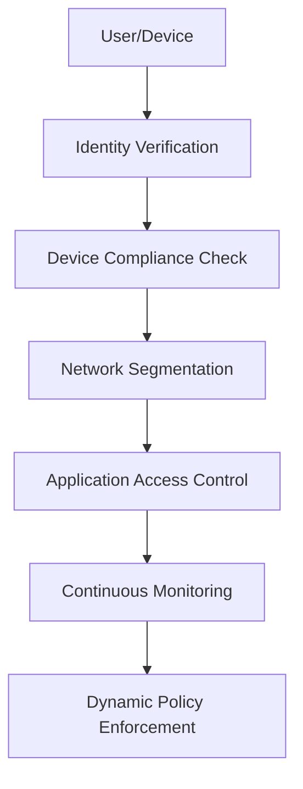

# Membangun Network Security Infrastructure untuk Enterprise: Best Practices 2024

Dengan meningkatnya kompleksitas ancaman siber dan remote work yang menjadi norma baru, infrastruktur keamanan jaringan enterprise harus dirancang dengan pendekatan **Zero Trust** dan **defense-in-depth strategy**. Artikel ini akan membahas implementasi praktis dari pengalaman real-world dalam mendesain network security untuk berbagai scale enterprise.

## 🎯 Network Security Framework Modern

### Zero Trust Architecture
**"Never trust, always verify"** - Philosophy ini menjadi foundation modern network security:



**Core Components:**
1. **Identity and Access Management (IAM)**
2. **Multi-Factor Authentication (MFA)**
3. **Network Segmentation (Micro-segmentation)**
4. **Endpoint Detection and Response (EDR)**
5. **Security Information and Event Management (SIEM)**

### Defense-in-Depth Layers
```
┌─────────────────────────────────────────┐
│ Layer 7: Data Protection & Encryption  │
├─────────────────────────────────────────┤
│ Layer 6: Application Security          │
├─────────────────────────────────────────┤
│ Layer 5: Endpoint Protection           │
├─────────────────────────────────────────┤
│ Layer 4: Network Access Control        │
├─────────────────────────────────────────┤
│ Layer 3: Network Segmentation          │
├─────────────────────────────────────────┤
│ Layer 2: Perimeter Security            │
├─────────────────────────────────────────┤
│ Layer 1: Physical Security             │
└─────────────────────────────────────────┘
```

## 🏗️ Enterprise Network Architecture Design

### 1. Three-Tier Architecture dengan Security Zones

**Core Network Design:**
```
Internet
    │
    ▼
┌─────────────────┐
│   DMZ Zone      │  ← Public-facing services
│  (Web, Email)   │
└─────────────────┘
    │
    ▼
┌─────────────────┐
│ Perimeter Zone  │  ← Firewall, IPS, Load Balancer
│   (Security)    │
└─────────────────┘
    │
    ▼
┌─────────────────┐
│ Internal Zone   │  ← Core network infrastructure
│  (LAN, Servers) │
└─────────────────┘
    │
    ▼
┌─────────────────┐
│ Secure Zone     │  ← Critical systems, Database
│ (Mgmt, Data)    │
└─────────────────┘
```

**Network Segmentation Strategy:**
```python
# VLAN Segmentation Example
vlans = {
    'management': {
        'vlan_id': 10,
        'subnet': '10.10.10.0/24',
        'access': 'admin_only',
        'security_level': 'high'
    },
    'servers': {
        'vlan_id': 20,
        'subnet': '10.20.20.0/24',
        'access': 'controlled',
        'security_level': 'high'
    },
    'user_network': {
        'vlan_id': 30,
        'subnet': '10.30.30.0/24',
        'access': 'standard',
        'security_level': 'medium'
    },
    'guest_network': {
        'vlan_id': 40,
        'subnet': '172.16.1.0/24',
        'access': 'internet_only',
        'security_level': 'low'
    },
    'iot_devices': {
        'vlan_id': 50,
        'subnet': '192.168.50.0/24',
        'access': 'isolated',
        'security_level': 'medium'
    }
}
```

### 2. High Availability & Redundancy Design

**Failover Configuration:**
```bash
# Cisco ASA Failover Configuration
interface GigabitEthernet0/3
 description LAN/STATE Failover Interface

failover
failover lan unit primary
failover lan interface failover-link GigabitEthernet0/3
failover key cisco123
failover link failover-link GigabitEthernet0/3
failover interface ip failover-link 192.168.100.1 255.255.255.0 standby 192.168.100.2
```

**Load Balancing dengan HAProxy:**
```nginx
# HAProxy Configuration for High Availability
global
    daemon
    maxconn 4096
    
defaults
    mode http
    timeout connect 5000ms
    timeout client 50000ms
    timeout server 50000ms
    
frontend web_frontend
    bind *:80
    bind *:443 ssl crt /etc/ssl/certs/server.pem
    redirect scheme https if !{ ssl_fc }
    
    # Security Headers
    http-response set-header X-Frame-Options DENY
    http-response set-header X-Content-Type-Options nosniff
    http-response set-header X-XSS-Protection "1; mode=block"
    
    default_backend web_servers
    
backend web_servers
    balance roundrobin
    option httpchk GET /health
    
    server web1 10.20.20.10:80 check
    server web2 10.20.20.11:80 check
    server web3 10.20.20.12:80 check
```

## 🔥 Firewall Configuration & Management

### Next-Generation Firewall (NGFW) Setup

**Palo Alto Networks Configuration:**
```xml
<!-- Security Policy Example -->
<security>
  <rules>
    <rule>
      <from>trust</from>
      <to>untrust</to>
      <source>any</source>
      <destination>any</destination>
      <application>web-browsing</application>
      <service>application-default</service>
      <action>allow</action>
      <profile-setting>
        <group>strict-security</group>
      </profile-setting>
    </rule>
  </rules>
</security>
```

**pfSense Open Source Alternative:**
```php
# pfSense Firewall Rules Configuration
# Allow SSH from Management Network
pass in on $lan_if from 10.10.10.0/24 to $lan_if port 22
keep state label "SSH from Management"

# Block Facebook Social Media
block in on $lan_if from $lan_net to facebook.com
block in on $lan_if from $lan_net to *.facebook.com

# Allow HTTPS outbound with deep packet inspection
pass out on $wan_if from $lan_net to any port 443 
keep state label "HTTPS Outbound"
```

### Intrusion Prevention System (IPS)

**Suricata Rule Configuration:**
```bash
# Custom Suricata Rules
# /etc/suricata/rules/custom.rules

# Detect SQL Injection attempts
alert http $HOME_NET any -> $EXTERNAL_NET any (
    msg:"Possible SQL Injection Attack"; 
    flow:established,to_server; 
    content:"union"; nocase; 
    content:"select"; nocase; 
    distance:0; within:100; 
    sid:1000001; 
    rev:1;
)

# Detect suspicious PowerShell commands
alert tcp $HOME_NET any -> $EXTERNAL_NET any (
    msg:"Suspicious PowerShell Download Command"; 
    flow:established,to_server; 
    content:"powershell"; nocase; 
    content:"downloadstring"; nocase; 
    distance:0; within:200; 
    sid:1000002; 
    rev:1;
)

# Detect cryptocurrency mining
alert http any any -> $HOME_NET any (
    msg:"Cryptocurrency Mining Pool Connection"; 
    flow:established,to_server; 
    content:"stratum+tcp"; 
    sid:1000003; 
    rev:1;
)
```

## 🔐 VPN Implementation & Management

### Site-to-Site VPN dengan IPSec

**Cisco Router IPSec Configuration:**
```bash
# Phase 1 (ISAKMP Policy)
crypto isakmp policy 10
 encr aes 256
 hash sha256
 authentication pre-share
 group 14
 lifetime 86400

crypto isakmp key MySecretKey address 203.0.113.2

# Phase 2 (IPSec Transform Set)
crypto ipsec transform-set MYSET esp-aes 256 esp-sha256-hmac
 mode tunnel

# Crypto Map
crypto map MYMAP 10 ipsec-isakmp
 set peer 203.0.113.2
 set transform-set MYSET
 match address VPN_TRAFFIC

# Access List for VPN Traffic
ip access-list extended VPN_TRAFFIC
 permit ip 192.168.1.0 0.0.0.255 192.168.2.0 0.0.0.255

# Apply to Interface
interface GigabitEthernet0/1
 crypto map MYMAP
```

### Remote Access VPN dengan WireGuard

**Modern VPN Solution:**
```ini
# /etc/wireguard/wg0.conf (Server)
[Interface]
Address = 10.200.200.1/24
SaveConfig = true
PrivateKey = SERVER_PRIVATE_KEY
ListenPort = 51820

# Firewall rules
PostUp = iptables -A FORWARD -i %i -j ACCEPT; iptables -A FORWARD -o %i -j ACCEPT; iptables -t nat -A POSTROUTING -o eth0 -j MASQUERADE
PostDown = iptables -D FORWARD -i %i -j ACCEPT; iptables -D FORWARD -o %i -j ACCEPT; iptables -t nat -D POSTROUTING -o eth0 -j MASQUERADE

# Client 1 - Admin
[Peer]
PublicKey = CLIENT1_PUBLIC_KEY
AllowedIPs = 10.200.200.2/32

# Client 2 - Developer
[Peer]
PublicKey = CLIENT2_PUBLIC_KEY
AllowedIPs = 10.200.200.3/32
```

**Client Configuration:**
```ini
# Client configuration
[Interface]
PrivateKey = CLIENT_PRIVATE_KEY
Address = 10.200.200.2/32
DNS = 10.10.10.1

[Peer]
PublicKey = SERVER_PUBLIC_KEY
Endpoint = vpn.company.com:51820
AllowedIPs = 10.0.0.0/8, 192.168.0.0/16
PersistentKeepalive = 25
```

## 🛡️ Network Access Control (NAC)

### 802.1X Implementation

**FreeRADIUS Configuration:**
```bash
# /etc/freeradius/clients.conf
client switch1 {
    ipaddr = 10.10.10.100
    secret = switch_secret_key
    shortname = "Core-Switch-1"
    nastype = cisco
}

# /etc/freeradius/users
# Network Admin - Full Access
"admin@company.com" Cleartext-Password := "AdminPass123"
    Service-Type = Framed-User,
    Tunnel-Type = VLAN,
    Tunnel-Medium-Type = IEEE-802,
    Tunnel-Private-Group-Id = "10"

# Regular User - Limited Access
"user@company.com" Cleartext-Password := "UserPass123"
    Service-Type = Framed-User,
    Tunnel-Type = VLAN,
    Tunnel-Medium-Type = IEEE-802,
    Tunnel-Private-Group-Id = "30"

# Guest User - Internet Only
"guest@company.com" Cleartext-Password := "GuestPass123"
    Service-Type = Framed-User,
    Tunnel-Type = VLAN,
    Tunnel-Medium-Type = IEEE-802,
    Tunnel-Private-Group-Id = "40"
```

**Cisco Switch 802.1X Configuration:**
```bash
# Global 802.1X configuration
aaa new-model
aaa authentication dot1x default group radius
aaa authorization network default group radius

radius server RADIUS1
 address ipv4 10.10.10.50 auth-port 1812 acct-port 1813
 key RadiusSecretKey

# Interface configuration
interface range gi0/1-48
 switchport mode access
 authentication host-mode multi-auth
 authentication port-control auto
 authentication periodic
 authentication timer restart 30
 dot1x pae authenticator
 dot1x timeout tx-period 10
```

## 📊 Security Monitoring & Logging

### SIEM Implementation dengan ELK Stack

**Elasticsearch Configuration:**
```yaml
# elasticsearch.yml
cluster.name: security-cluster
node.name: siem-node-1
path.data: /var/lib/elasticsearch
path.logs: /var/log/elasticsearch
network.host: 0.0.0.0
http.port: 9200

# Security settings
xpack.security.enabled: true
xpack.security.transport.ssl.enabled: true
xpack.security.http.ssl.enabled: true
```

**Logstash Firewall Log Processing:**
```ruby
# /etc/logstash/conf.d/firewall.conf
input {
  syslog {
    port => 514
    type => "firewall"
  }
}

filter {
  if [type] == "firewall" {
    grok {
      match => { 
        "message" => "%{SYSLOGTIMESTAMP:timestamp} %{IPORHOST:device} %{WORD:action} %{IPORHOST:src_ip} %{IPORHOST:dst_ip} %{INT:src_port} %{INT:dst_port} %{WORD:protocol}"
      }
    }
    
    date {
      match => [ "timestamp", "MMM dd HH:mm:ss" ]
    }
    
    mutate {
      convert => { "src_port" => "integer" }
      convert => { "dst_port" => "integer" }
    }
    
    # GeoIP lookup for source IP
    geoip {
      source => "src_ip"
      target => "geoip"
    }
  }
}

output {
  elasticsearch {
    hosts => ["localhost:9200"]
    index => "firewall-logs-%{+YYYY.MM.dd}"
  }
}
```

**Kibana Dashboard Configuration:**
```json
{
  "visualizations": [
    {
      "title": "Top Source IPs",
      "type": "pie",
      "query": {
        "bool": {
          "must": [
            {"term": {"action": "DENY"}}
          ]
        }
      },
      "aggregations": {
        "src_ips": {
          "terms": {
            "field": "src_ip.keyword",
            "size": 10
          }
        }
      }
    },
    {
      "title": "Traffic by Country",
      "type": "map",
      "geo_field": "geoip.location"
    }
  ]
}
```

### Network Monitoring dengan Nagios

**Nagios Service Definitions:**
```bash
# /etc/nagios/objects/network-devices.cfg

# Core Switch Monitoring
define host {
    use                     linux-server
    host_name               core-switch-1
    alias                   Core Switch 1
    address                 10.10.10.100
    check_command           check-host-alive
    max_check_attempts      5
    check_period            24x7
    notification_interval   30
    notification_period     24x7
}

define service {
    use                     generic-service
    host_name               core-switch-1
    service_description     PING
    check_command           check_ping!200.0,20%!600.0,60%
}

define service {
    use                     generic-service
    host_name               core-switch-1
    service_description     SNMP
    check_command           check_snmp!-C public -o 1.3.6.1.2.1.1.3.0
}

# Bandwidth monitoring
define service {
    use                     generic-service
    host_name               core-switch-1
    service_description     Port Utilization Gi0/1
    check_command           check_snmp_int!public!1!80,90
}
```

## 🚨 Incident Response & Forensics

### Network Forensics dengan tcpdump & Wireshark

**Automated Packet Capture:**
```bash
#!/bin/bash
# network-forensics.sh

# Configuration
INTERFACE="eth0"
CAPTURE_DIR="/var/log/network-forensics"
MAX_SIZE="1000"  # MB
ROTATE_COUNT="10"

# Create capture directory
mkdir -p $CAPTURE_DIR

# Function to rotate captures
rotate_captures() {
    cd $CAPTURE_DIR
    ls -t *.pcap | tail -n +$((ROTATE_COUNT + 1)) | xargs -r rm
}

# Continuous capture with rotation
tcpdump -i $INTERFACE -s 65535 -C $MAX_SIZE -W $ROTATE_COUNT \
    -w "$CAPTURE_DIR/capture_$(date +%Y%m%d_%H%M%S).pcap" \
    -Z root &

# Monitor for suspicious activity
tcpdump -i $INTERFACE -nn \
    'host 192.168.1.0/24 and (port 22 or port 3389 or port 443)' | \
    while read line; do
        echo "$(date): $line" >> $CAPTURE_DIR/suspicious_activity.log
        
        # Alert on multiple failed connections
        if echo "$line" | grep -q "RST"; then
            echo "ALERT: Possible brute force detected: $line" | \
            mail -s "Security Alert" admin@company.com
        fi
    done
```

**Wireshark Analysis Scripts:**
```python
# wireshark_analysis.py
import pyshark

def analyze_suspicious_traffic(pcap_file):
    cap = pyshark.FileCapture(pcap_file, display_filter='tcp.flags.reset==1')
    
    suspicious_ips = {}
    
    for packet in cap:
        try:
            src_ip = packet.ip.src
            dst_ip = packet.ip.dst
            
            if src_ip not in suspicious_ips:
                suspicious_ips[src_ip] = {'reset_count': 0, 'targets': set()}
            
            suspicious_ips[src_ip]['reset_count'] += 1
            suspicious_ips[src_ip]['targets'].add(dst_ip)
            
        except AttributeError:
            continue
    
    # Report IPs with high reset count (possible port scanning)
    for ip, data in suspicious_ips.items():
        if data['reset_count'] > 50:  # Threshold
            print(f"SUSPICIOUS: {ip} sent {data['reset_count']} RST packets to {len(data['targets'])} targets")

if __name__ == "__main__":
    analyze_suspicious_traffic("suspicious_traffic.pcap")
```

## 🔧 Automation & Orchestration

### Network Security Automation dengan Ansible

**Firewall Rule Deployment:**
```yaml
# deploy-firewall-rules.yml
---
- name: Deploy Firewall Rules
  hosts: firewalls
  gather_facts: no
  
  vars:
    firewall_rules:
      - { src: "10.10.10.0/24", dst: "any", port: "22", action: "allow", comment: "SSH from Management" }
      - { src: "any", dst: "facebook.com", port: "443", action: "deny", comment: "Block Facebook" }
      - { src: "10.30.30.0/24", dst: "any", port: "80,443", action: "allow", comment: "HTTP/HTTPS for Users" }
  
  tasks:
    - name: Configure firewall rules
      panos_security_rule:
        provider: "{{ device }}"
        rule_name: "{{ item.comment }}"
        source_zone: ["trust"]
        destination_zone: ["untrust"]
        source_ip: ["{{ item.src }}"]
        destination_ip: ["{{ item.dst }}"]
        application: ["web-browsing", "ssl"]
        service: ["application-default"]
        action: "{{ item.action }}"
        state: present
      loop: "{{ firewall_rules }}"
      
    - name: Commit configuration
      panos_commit:
        provider: "{{ device }}"
```

**Network Device Backup Automation:**
```python
# network_backup.py
import paramiko
import schedule
import time
from datetime import datetime

class NetworkBackup:
    def __init__(self, devices):
        self.devices = devices
        
    def backup_cisco_device(self, device):
        try:
            ssh = paramiko.SSHClient()
            ssh.set_missing_host_key_policy(paramiko.AutoAddPolicy())
            ssh.connect(
                device['ip'], 
                username=device['username'], 
                password=device['password']
            )
            
            # Execute show running-config
            stdin, stdout, stderr = ssh.exec_command('show running-config')
            config = stdout.read().decode()
            
            # Save configuration
            timestamp = datetime.now().strftime('%Y%m%d_%H%M%S')
            filename = f"backup_{device['hostname']}_{timestamp}.txt"
            
            with open(f"/backup/{filename}", 'w') as f:
                f.write(config)
                
            ssh.close()
            print(f"Backup completed for {device['hostname']}")
            
        except Exception as e:
            print(f"Backup failed for {device['hostname']}: {str(e)}")
    
    def backup_all_devices(self):
        for device in self.devices:
            self.backup_cisco_device(device)

# Device list
devices = [
    {'ip': '10.10.10.100', 'hostname': 'core-switch-1', 'username': 'admin', 'password': 'password'},
    {'ip': '10.10.10.101', 'hostname': 'firewall-1', 'username': 'admin', 'password': 'password'}
]

backup_manager = NetworkBackup(devices)

# Schedule daily backup at 2 AM
schedule.every().day.at("02:00").do(backup_manager.backup_all_devices)

# Run scheduler
while True:
    schedule.run_pending()
    time.sleep(3600)  # Check every hour
```

## 📈 Performance Optimization & Scalability

### Network Performance Monitoring

**MRTG Configuration for Bandwidth Monitoring:**
```bash
# /etc/mrtg/mrtg.cfg

# Global settings
WorkDir: /var/www/html/mrtg
Options[_]: growright,bits

# Core Switch Interface Monitoring
Target[switch1_gi0_1]: 2:public@10.10.10.100:161:
SetEnv[switch1_gi0_1]: MRTG_INT_IP="10.10.10.100" MRTG_INT_DESCR="gi0/1"
MaxBytes[switch1_gi0_1]: 125000000
Title[switch1_gi0_1]: Core Switch 1 - GigabitEthernet 0/1
PageTop[switch1_gi0_1]: <h1>Core Switch 1 Port Gi0/1 Utilization</h1>

# Internet Gateway Monitoring
Target[gateway_wan]: 1:public@10.10.10.1:161:
MaxBytes[gateway_wan]: 12500000
Title[gateway_wan]: Internet Gateway WAN Interface
PageTop[gateway_wan]: <h1>Internet Gateway Bandwidth Usage</h1>
```

**Network Latency Monitoring:**
```python
# network_latency_monitor.py
import subprocess
import time
import json
from datetime import datetime

class LatencyMonitor:
    def __init__(self, targets):
        self.targets = targets
        self.results = []
    
    def ping_host(self, host):
        try:
            result = subprocess.run(
                ['ping', '-c', '4', host], 
                capture_output=True, 
                text=True, 
                timeout=10
            )
            
            if result.returncode == 0:
                # Parse ping output for average latency
                lines = result.stdout.split('\n')
                for line in lines:
                    if 'avg' in line:
                        avg_latency = float(line.split('/')[4])
                        return avg_latency
            return None
            
        except Exception as e:
            print(f"Ping failed for {host}: {str(e)}")
            return None
    
    def monitor_all_targets(self):
        timestamp = datetime.now().isoformat()
        current_results = {'timestamp': timestamp, 'latencies': {}}
        
        for target in self.targets:
            latency = self.ping_host(target)
            current_results['latencies'][target] = latency
            
            if latency and latency > 100:  # Alert if latency > 100ms
                print(f"HIGH LATENCY ALERT: {target} - {latency}ms")
        
        self.results.append(current_results)
        
        # Save to file
        with open('/var/log/latency_monitor.json', 'w') as f:
            json.dump(self.results, f, indent=2)

# Monitor critical hosts
targets = ['8.8.8.8', '1.1.1.1', 'google.com', 'company-server.com']
monitor = LatencyMonitor(targets)

# Run every 5 minutes
while True:
    monitor.monitor_all_targets()
    time.sleep(300)
```

## 💰 Cost Optimization Strategies

### Open Source Alternatives untuk Enterprise

**Cost Comparison Analysis:**
```
Commercial vs Open Source Solutions:

Firewall:
- Palo Alto PA-220: $1,500 + $400/year support
- pfSense on Dell OptiPlex: $300 + $0/year support
- SAVINGS: 80% initial cost, 100% ongoing

SIEM:
- Splunk Enterprise: $150/GB/day
- ELK Stack on Linux: $0 + hardware/maintenance
- SAVINGS: 90%+ depending on log volume

VPN:
- Cisco ASA 5506-X: $700 + $200/year licensing
- WireGuard on Linux: $200 + $0/year licensing
- SAVINGS: 70% initial, 100% ongoing

Network Monitoring:
- SolarWinds NPM: $3,000/year for 100 nodes
- Nagios + MRTG: $0 + maintenance time
- SAVINGS: 100% licensing costs
```

**Hybrid Approach Recommendation:**
```python
# Recommended enterprise approach
infrastructure_strategy = {
    'critical_systems': {
        'solution': 'commercial',
        'reason': 'vendor_support_required',
        'examples': ['core_firewall', 'load_balancer']
    },
    'monitoring_systems': {
        'solution': 'open_source',
        'reason': 'cost_effective_and_flexible',
        'examples': ['log_analysis', 'network_monitoring']
    },
    'edge_devices': {
        'solution': 'hybrid',
        'reason': 'balance_cost_and_reliability',
        'examples': ['branch_firewalls', 'access_points']
    }
}
```

## 🎯 Implementation Roadmap

### Phase 1: Foundation (Bulan 1-2)
- [ ] Network architecture assessment dan design
- [ ] Core infrastructure deployment (firewalls, switches)
- [ ] Basic segmentation dan VLANs
- [ ] Initial monitoring setup

### Phase 2: Security Hardening (Bulan 3-4)
- [ ] Advanced firewall rules implementation
- [ ] IPS/IDS deployment
- [ ] VPN implementation
- [ ] 802.1X network access control

### Phase 3: Monitoring & Automation (Bulan 5-6)
- [ ] SIEM deployment dan tuning
- [ ] Automated backup systems
- [ ] Performance monitoring dashboards
- [ ] Incident response procedures

### Phase 4: Optimization & Scaling (Bulan 7-12)
- [ ] Performance optimization
- [ ] Redundancy implementation
- [ ] Advanced threat detection
- [ ] Disaster recovery testing

## 💡 Lessons Learned dari Real Implementations

**Common Pitfalls yang Harus Dihindari:**

1. **Over-engineering di awal** - Start simple, scale gradually
2. **Insufficient documentation** - Document setiap perubahan konfigurasi
3. **Vendor lock-in** - Maintain compatibility dengan open standards
4. **Neglecting user training** - Security is only as strong as the weakest link

**Success Factors:**
- **Stakeholder buy-in** dari management dan end users
- **Proper change management** processes
- **Regular security assessments** dan penetration testing
- **Continuous monitoring** dan improvement

**ROI Metrics yang Proved Valuable:**
- Reduced security incidents: 70% reduction in malware infections
- Improved compliance: 100% audit compliance achievement
- Cost savings: 40% reduction in security-related operational costs
- Business continuity: 99.9% network uptime achievement

## 🚀 Kesimpulan

Membangun network security infrastructure untuk enterprise membutuhkan pendekatan holistik yang menggabungkan people, process, dan technology. Key takeaways:

1. **Zero Trust is mandatory** - Verify everything, trust nothing
2. **Defense-in-depth** - Multiple layers of security
3. **Automation is critical** - Reduce human error dan improve response time
4. **Continuous monitoring** - Threats evolve constantly
5. **Cost optimization** - Balance security with business requirements

Modern network security bukan lagi tentang building fortress walls, tapi creating adaptive immune system yang bisa detect, respond, dan recover dari threats secara real-time.

**Next steps:** Start dengan risk assessment, design architecture berdasarkan business requirements, implement secara bertahap, dan selalu maintain situational awareness terhadap emerging threats.

---

*Need help designing network security infrastructure untuk organization Anda? Atau ada questions tentang specific implementations? Feel free to reach out via [email](mailto:erzambayu@gmail.com). Happy securing! 🛡️*